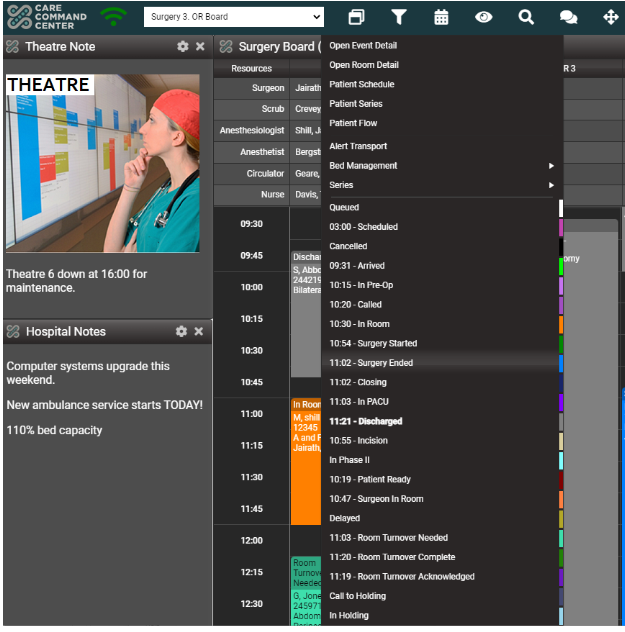
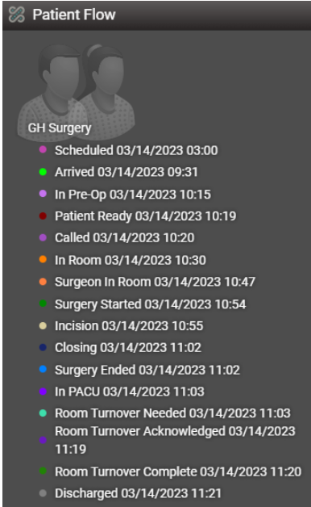

--- 
layout: default
title: Challenge
---

<h2>AnalystX Patient Flow Challenge Series</h2>

Learn to use process mining tools to identify patient flow insights in our challenge series.

<h3>SERIES 1: THEATRE PATIENT FLOW </h3>

<h2>Every process recorded from Patient Arrival to Discharge to ward </h2>
<ul class="nhsuk-grid-row nhsuk-card-group">
    <li class="nhsuk-grid-column-one-half nhsuk-card-group__item">
        

            
            

            

        

    </li>
    <li class="nhsuk-grid-column-one-half nhsuk-card-group__item">
        

            
            

            

        

    </li>
</ul>

<h2>

<h4>What to expect</h4>

Our expert team will provide you with theatre workflow data from a theatre command centre and show you how to use process mining tools to interrogate the data to identify data errors, opportunities to optimise resource allocation and reduce unwarranted variations.

The Challenge will take up to 3 hours consisting of learning, practical data interrogation and feedback. You will be expected to complete the Challenge as a Theatre team.

<h4>
How to participate</h4>

Our team will support NHS Theatre teams currently working on improving theatre flow, productivity or patient safety to explore how process mining insights can help.

You will need be a multi-disciplinary Theatre team consisting of at least one clinical, one operational and one analytics professional to take part.  Your team must be ready to commit 3 hours to attend the Challenge which can be delivered at your Trust.

Please <a href="mailto=england.analystx@nhs.net">get in touch</a> to find out more or <a href="https://forms.office.com/e/6GKq8BFBCK">register your interest</a>

